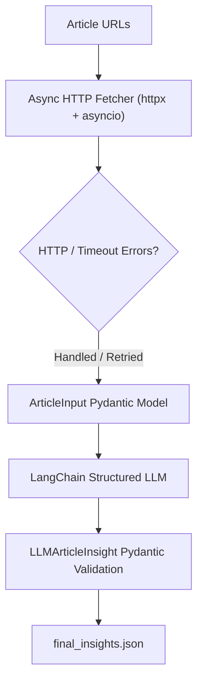

# Concurrent Multi-Source News Scraper & LLM Summarizer

A Python application that demonstrates asynchronous web scraping with `httpx` and `asyncio`, robust error handling, Pydantic type-safe data modeling, and structured AI summarization with LangChain (`.with_structured_output()`).

---

## 📑 Pipeline Architecture



---

## ⚙️ Features

1. **Real-Time Live News Discovery**: Dynamically queries the Hacker News Algolia Live API to discover real-time live articles with zero API keys required.
2. **Async Concurrent Scraping**: Uses `httpx.AsyncClient` with `asyncio.gather()` to fetch multiple URLs simultaneously.
3. **Resilient Error Handling**: Gracefully catches HTTP errors (4xx, 5xx), connection timeouts, and network issues without interrupting other tasks.
4. **Pydantic Validation**:
   - `ArticleInput`: Validates raw fetched payloads.
   - `LLMArticleInsight`: Enforces constraints on AI output (`urgency_score` between 1 and 10, category literal choices `Tech | Business | Health | Other`).
5. **LangChain Structured Output**: Configured with `.with_structured_output(LLMArticleInsight)` to ensure deterministic JSON schemas from LLM responses.
6. **Bonus Capabilities**:
   - **Retry Mechanism**: Automatically retries failed requests before marking as failed.
   - **Performance Benchmarking**: Compares concurrent vs. sequential execution time.
   - **Logging**: Configured via Python's standard `logging` module.
   - **Failed Articles Log**: Saves handled failures into `failed_articles.json`.

---

## 🚀 Setup & Installation

### 1. Install Dependencies
```bash
pip install -r requirements.txt
# OR
pip install httpx pydantic langchain langchain-groq python-dotenv
```

### 2. Configure Environment Variables (Optional)
Copy `.env.example` to `.env` and insert your API key:
```env
GROQ_API_KEY=your_groq_api_key_here
LLM_MODEL=openai/gpt-oss-120b
```
*(Note: If no API key is provided, the script runs in simulation fallback mode to demonstrate full pipeline and Pydantic validation without errors).*

### 3. Run the Application
```bash
python main.py
```

---

## 📂 Project Structure
```text
news-scraper/
├── main.py               # Complete async fetching, Pydantic models, and LangChain pipeline
├── final_insights.json   # Exported structured insights JSON
├── failed_articles.json  # Log of gracefully handled errors (404s, Timeouts)
├── README.md             # Documentation and usage guide
├── pyproject.toml        # Package & dependency definitions
├── requirements.txt      # Dependency list
└── .env                  # API keys and environment configuration
```

---

## 📊 Sample Output (`final_insights.json`)

```json
[
  {
    "title": "Regex Storm with NetWasm",
    "summary": "Regex Storm is a browser-based tester that runs the real .NET regular expression engine compiled to WebAssembly via NetWasm. It lets users write, test, and debug .NET regex patterns entirely client-side, keeping data private and requiring no server.",
    "topics": [
      ".NET",
      "WebAssembly",
      "Regular Expressions",
      "C#",
      "Browser-based development"
    ],
    "urgency_score": 4,
    "category": "Tech"
  },
  {
    "title": "ElevenLabs Unveils Eleven v4 and v4 Turbo, Ranked #1 by Artificial Analysis",
    "summary": "ElevenLabs announced the release of its latest voice generation models, Eleven v4 and Eleven v4 Turbo, claiming they are the fastest and most emotive AI voice models to date. The new models have been ranked #1 by Artificial Analysis, highlighting their leading performance in the AI speech synthesis market.",
    "topics": [
      "ElevenLabs",
      "AI voice models",
      "Eleven v4",
      "Eleven v4 Turbo",
      "Artificial Analysis"
    ],
    "urgency_score": 6,
    "category": "Tech"
  },
  {
    "title": "Zero-Growth Stack, Real Gains: How Stack Allocation Can Save 10% CPU in Go",
    "summary": "Uber's engineering team describes a 'zero-growth' stack allocation technique in Go that eliminates unnecessary heap allocations. By redesigning data structures to use fixed-size stacks, they achieve roughly a 10% reduction in CPU usage for critical services.",
    "topics": [
      "Go programming language",
      "stack allocation",
      "performance optimization",
      "Uber engineering",
      "zero-growth stack"
    ],
    "urgency_score": 5,
    "category": "Tech"
  }
]
```
